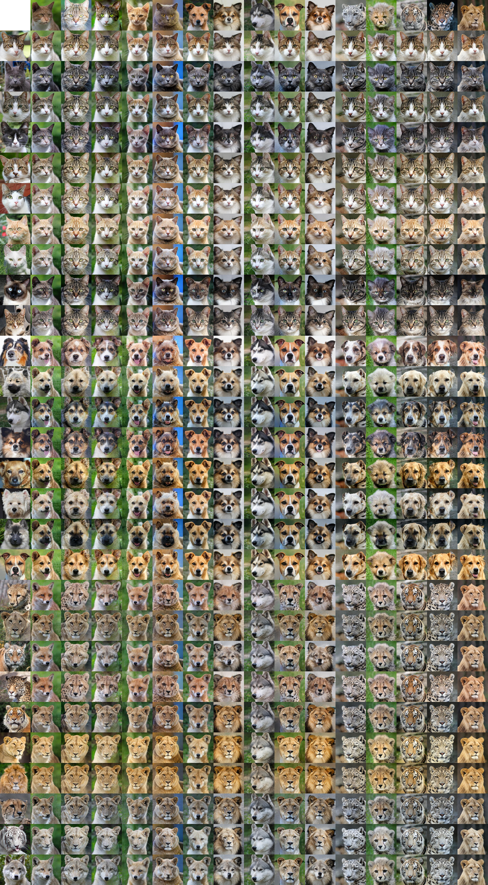
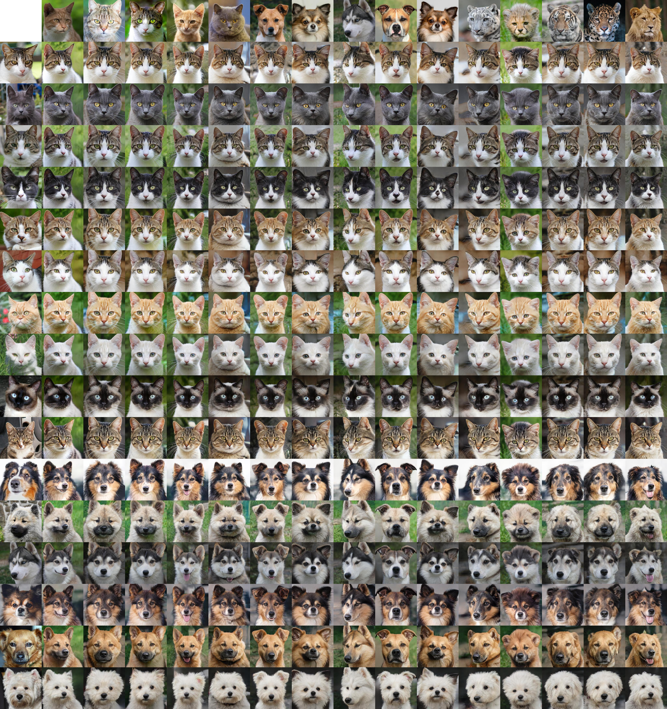

# StarGAN2j - A Jittor Implementation of StarGANv2

## StarGAN2j - StarGANv2官方仓库的个人复现（计图）
>CCF-GrokCV 新芽计划 第二阶段考核任务 \
>[鲁昕宁](https://github.com/SidneyLu) 南开大学 [Sending Feedbacks](mailto:2414015@mail.nankai.edu.cn)  
由于工作量和计算资源的限制，目前仅复现了基于AFHQ2数据集的模型训练、评估、加载、保存功能及图片生成功能

>Original Paper: https://arxiv.org/abs/1912.01865 <br>
> Official Pytorch Implementation: https://github.com/clovaai/stargan-v2 <br>
>> **StarGAN v2: Diverse Image Synthesis for Multiple Domains**<br>
> [Yunjey Choi](https://github.com/yunjey)\*, [Youngjung Uh](https://github.com/youngjung)\*, [Jaejun Yoo](http://jaejunyoo.blogspot.com/search/label/kr)\*, [Jung-Woo Ha](https://www.facebook.com/jungwoo.ha.921)<br>
> In CVPR 2020. (* indicates equal contribution)<br>

## Training Log Available Soon！！！

## Dependencies
### Linux or WSL:
Check your g++ compiler first
```bash
sudo apt install g++-11
sudo update-alternatives --install /usr/bin/g++ g++ /usr/bin/g++-11 100
```
Then prepare your conda environment
```bash
conda create -n stargan-v2j python=3.10
conda activate stargan-v2j
conda install -c conda-forge libstdcxx-ng=12.3.0 -y
```
```bash
pip install -r requirements.txt
```
Warnings: 
- Note that the Jittor is only compatible with earlier versions of NumPy, and it needs PyTorch to load the pretrained model (in .pth format). 
- Please check all the libraries (e.g. opencv-python) depending on NumPy thoroughly in advance, and downgrade them if necessary. 
- Jittor will detect your system CUDA path automatically, in case of unknown problems, specifying Jittor's own CUDA path is highly recommended, e.g.:
    ```bash
    python -m jittor_utils.install_cuda 
    ```
- The default cuda version is 12.2, with cuDNN 8, DO NOT USE cuDNN 9 or later!
- CUDA 11.7/11.8/12.2/12.4/12.8 are all supported. 
- Ada Lovelace(RTX40 Series) >= 11.8, Blackwell(RTX50 Series) >= 12.8
- CORRECT File `/envs/stargan-v2j/lib/python3.10/site-packages/jittor/compile_extern.py`, in line 459  
    CHANGE
    ```
    url = "https://cloud.tsinghua.edu.cn/f/171e49e5825549548bc4/?dl=1"
    ```
    INTO
    ```
    url = "https://cg.cs.tsinghua.edu.cn/jittor/assets/cutlass.zip"
    ```
    (The original url is broken)

Check if your environment is ready:
```bash
python -m jittor.test.test_example
python -m jittor.test.test_cudnn_op
```

### Windows 
Not recommended, for unknown compile error while installing Jittor

### MacOS 
Not tested

## Generation
Prepare your source images and reference images in `assets/src` and `assets/ref` directories respectively. \
Then run
```bash
python main.py --mode sample --resume_iter 100000 
```
Pretrained weights can be downloaded from https://pan.baidu.com/s/1b5aMoZvAwK6Dkl1WfXnLmw?pwd=k74b \
Outputs will be saved in `expr/results` directory. 

## Training 
### (on AFHQ2 Dataset)
Get the dataset from https://www.dropbox.com/s/vkzjokiwof5h8w6/afhq_v2.zip?dl=0
Then
```bash
python main.py --mode train 
```
Generated images and network checkpoints will be stored in `expr/samples` and `expr/checkpoints` directories respectively. \
Total iterations: 100000
Trained on RTX 4090 (48GB), single GPU, 
Original training logs are also saved in `expr/checkpoints`  
`logt` - PyTorch, `logj` - Jittor

## Evaluation
| Dataset | FID (latent) | LPIPS (latent) | FID (reference) | LPIPS (reference) |
|:-------:|:------------:|:--------------:|:---------------:|:-----------------:|
|  AFHQ2  |              |                |                 |                   |

run
```bash
python main.py --mode eval --resume_iter 100000
```
Your evaluation results will be saved into `expr/eval`
Original evaluation logs are also saved in `expr/eval`
`evalt` - PyTorch, `evalj` - Jittor

## Alignment with Official Pytorch Implementation
### Loss Curves

### Evaluation Metrics (on AFHQ2 Dataset)
Referring to the official pretrained weights for real performance.

| Implementation  | FID (latent) | LPIPS (latent) | FID (reference) | LPIPS (reference) |
|:---------------:|:------------:|:--------------:|:---------------:|:-----------------:|
|     PyTorch     |   16.9997    |     0.4495     |     20.6854     |      0.4318       |
|     Jittor      |              |                |                 |                   |   


### Samples
#### PyTorch
<p></p>

#### Jittor
<p></p>

## Citation
```
@InProceedings{Choi_2020_CVPR,
author = {Choi, Yunjey and Uh, Youngjung and Yoo, Jaejun and Ha, Jung-Woo},
title = {StarGAN v2: Diverse Image Synthesis for Multiple Domains},
booktitle = {IEEE/CVF Conference on Computer Vision and Pattern Recognition (CVPR)},
month = {June},
year = {2020}
}
```
## Acknowledgements
